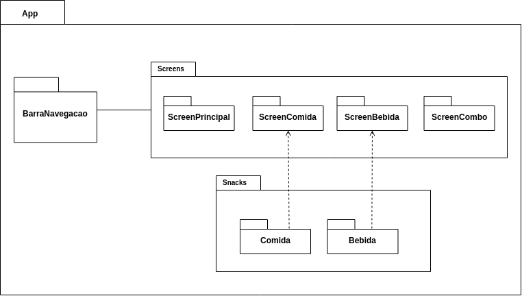
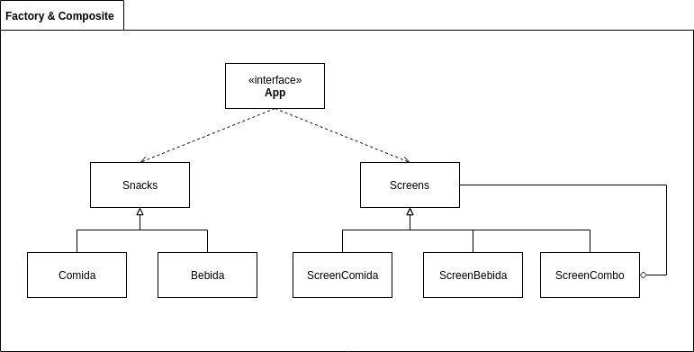
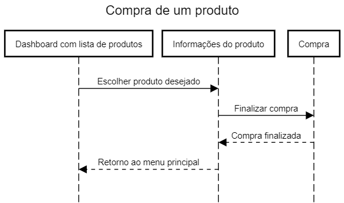

# Trabalho extra Desenho

O seguinte projeto simula a compra de produto em um cardápio feito para uma lanchonete.
Nele temos um menu com comidas, bebidas e combos.

# Padrões Arquiteturais

A seguir teremos os padrões arquiteturais no projeto.

## Visão Geral

Este projeto fora dividido nos seguintes módulos.

## Padrões Factory Method e Composite

### Factory Method

Este padrão foi aplicado no projeto de forma que o componente App funciona como uma interface e o método de fabricação é estendido para a Screens que é a"fábrica" de uma Snack, ou seja, se desejo apresentar os detalhes de uma ComidaX na tela a ScreenComidaX irá fabricar essa tela. 

### Composite

Este padrão foi aplicado no projeto de forma que a Screens pode combinar várias telas ou simplesmente apresentar uma única tela, ou seja, se desejo apresentar o ComboX que é composta pela ComidaX e pela BebidaX irei renderizar a ScreenComboX que combina essas duas telas, ScreenComidaX e ScreenBebidaX.

# Diagrama de sequência

O diagrama de sequência é a solução dinâmica de modelagem em UML mais relevante, pois incide sobre o período entre a fase inicial e a fase final de um projeto. No Diagrama abaixo, foi representado o fluxo de compra de um produto.

